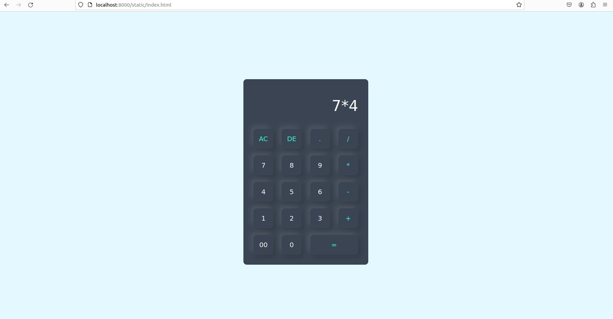

# Design of a Standard Calculator

## AIM:

To design a web application for a standard calculator.

## DESIGN STEPS:

### Step 1:
Fork the given repository and make some changes in settings.py file.


### Step 2:
create a html file for calculation and a basic overview of clculator and make a code for background calculation in html itself.

### Step 3:
create a css file for give a desing for our calculator.

### Step 4:
join the two file with a code.

### Step 5:
Validate the HTML and CSS code.

### Step 6:

Validate the HTML and CSS code.

### Step 6:

Publish the website in the given URL.

## PROGRAM :
## codes written in html
```
<!DOCTYPE html>
<html>
<head>
    <meta name="viewport" content="width=device-width, initial-scale=1.0">
    <title>Calculator using javascript - Easy Tutorials</title>
    <link rel="stylesheet" href="style.css">
</head>
<body>

<div class="container">
  <div class="calculator">
    <form>
      <div class="display">
        <input type="text" name="display">
      </div>
      <div>
        <input type="button" value="AC" onclick="display.value = '' " class="operator">
        <input type="button" value="DE" onclick="display.value =  display.value.toString().slice(0,-1)" class="operator">
        <input type="button" value="." onclick="display.value += '.' " class="operator">
        <input type="button" value="/" onclick="display.value += '/' " class="operator">
      </div>
      <div>
        <input type="button" value="7" onclick="display.value += '7' ">
        <input type="button" value="8" onclick="display.value += '8' ">
        <input type="button" value="9" onclick="display.value += '9' ">
        <input type="button" value="*" onclick="display.value += '*' " class="operator">
      </div>
      <div>
        <input type="button" value="4" onclick="display.value += '4' ">
        <input type="button" value="5" onclick="display.value += '5' ">
        <input type="button" value="6" onclick="display.value += '6' ">
        <input type="button" value="-" onclick="display.value += '-' " class="operator">
      </div>
      <div>
        <input type="button" value="1" onclick="display.value += '1' ">
        <input type="button" value="2" onclick="display.value += '2' ">
        <input type="button" value="3" onclick="display.value += '3' ">
        <input type="button" value="+" onclick="display.value += '+' " class="operator">
      </div>
      <div>
        <input type="button" value="00" onclick="display.value += '00' ">
        <input type="button" value="0" onclick="display.value += '0' ">
        <input type="button" value="=" onclick="display.value = eval(display.value)" class="equal operator">
       
      </div>
    </form>
  </div>
</div>


</body>
</html>
```
## codes written in css
```
*{
    margin: 0;
    padding: 0;
    font-family: 'Poppins', sans-serif;
    box-sizing: border-box;
}


.container{
    width: 100%;
    height: 100vh;
    background: #e3f9ff;
    display: flex;
    align-items: center;
    justify-content: center;
}
.calculator{
    background: #3a4452;
    padding: 20px;
    border-radius: 10px;
}
.calculator form input{
    border: 0;
    outline: 0;
    width: 60px;
    height: 60px;
    border-radius: 10px;
    box-shadow: -8px -8px 15px rgba(255, 255, 255, 0.1),5px 5px 15px rgba(0, 0, 0, 0.2);
    background: transparent;
    font-size: 20px;
    color: #fff;
    cursor: pointer;
    margin: 10px;
}

form .display{
    display: flex;
    justify-content: flex-end;
    margin: 20px 0;
}
form .display input{
    text-align: right;
    flex: 1;
    font-size: 45px;
    box-shadow: none;
}
form input.equal{
    width: 145px;
}


form input.operator{
    color: #33ffd8;
}


```
## OUTPUT:


## Result:
The program run sucessfully.

